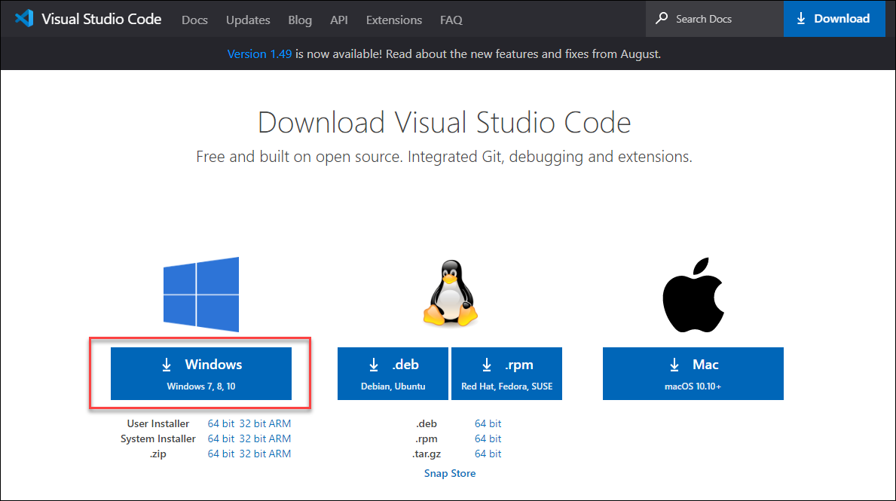

# Introduction

This is Ivan Cheban's test MkDocs site. This is version 0.1.

!!! note

    This is work in progress.




## Tabs

=== "Windows"
    Markdown **content**.

    Multiple paragraphs.

=== "Linux"
    More Markdown **content**.

    - list item a
    - list item b

## Code blocks

```json
{
  "name": "Ivan",
  "last name": "Cheban",
  "age": 42
}
```

## Flow charts


## ERD diagrams


## Sequence diagrams


